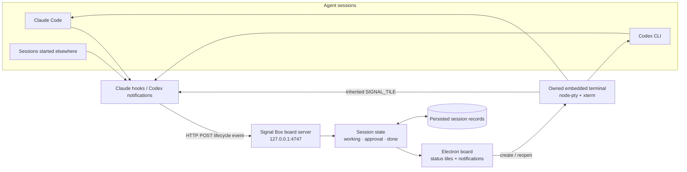

# Signal Box

Signal Box is an Electron desktop board for monitoring Claude Code and Codex CLI
sessions and opening remotely controllable shell terminals. Agent tiles
represent persistent lifecycle state:

| Lamp | State | Meaning |
| --- | --- | --- |
| Green | Working | The agent is handling a turn. |
| Amber | Approval | The agent needs permission or input. |
| Red | Done | The turn finished and needs attention. |
| Unlit | Idle | The session is open, but no lifecycle event is known. |

Signal Box receives lifecycle events through local hooks. It does not inspect
terminal text to guess state.

## Schematic



Hooks report lifecycle state to the local server; the board renders persistent
tiles and owns a correlation ID for sessions launched inside the app.

## Requirements

- Node.js 18 or newer
- npm
- Claude Code and/or Codex CLI on `PATH`
- An Electron-compatible display
- A native build toolchain if `node-pty` must compile locally

Linux and macOS are the primary targets. Windows support uses Electron and
`node-pty` but has had less testing.

## WSL2 and WSLg

WSL2 with WSLg is supported. Check the display environment:

```bash
echo "$DISPLAY"
echo "$WAYLAND_DISPLAY"
echo "$WSL_DISTRO_NAME"
```

Run npm, Claude Code, Codex, and Signal Box from the same WSL distribution.
Claude and Codex configuration is stored in the WSL home directory:

```text
/home/your-user/.claude/settings.json
/home/your-user/.codex/config.toml
```

Signal Box automatically disables Electron GPU acceleration in WSLg. Its
launcher also removes `ELECTRON_RUN_AS_NODE`, which can cause Electron to
start as plain Node.js.

## Installation

```bash
cd /home/your-user/code-traffic
npm install
```

The install includes Electron, `node-pty`, xterm, and
`@electron/rebuild`. The `postinstall` script attempts to rebuild
`node-pty` against Electron. Rebuild failure does not prevent board-only
operation.

## Start

```bash
npm start
```

The board displays project name, path, state lamp, elapsed state time, sound
control, agent selector, new-session control, and a confirmed **Clear all**
action. Clear all removes every tile and terminates processes owned by Signal
Box.

Session records are persisted in Electron’s user-data directory. A session
created by Signal Box remains an owned, openable tile after restarting the app;
clicking it starts Claude with `--resume` or Codex with `resume` when a session
ID is available.

## Claude Code hooks

Install the global Claude hooks once:

```bash
npm run install-hooks
```

This updates `~/.claude/settings.json`. The installer preserves unrelated
settings and hooks, creates a backup, is idempotent, and rejects invalid JSON
without modifying the file.

Inspect the generated handlers:

```bash
npm run hooks:print
```

Inside Claude Code, run `/hooks` to inspect active hooks and their source file.

## Codex notifications

Install the Codex adapter:

```bash
npm run install-codex-hooks
```

This updates `$CODEX_HOME/config.toml` when `CODEX_HOME` is set, otherwise
`~/.codex/config.toml`, and points Codex notifications at `codex-notify.js`.
Inspect the generated line with:

```bash
node codex-hooks.js --print
```

The adapter maps notification names containing `start`, `begin`, `working`,
`approval`, `permission`, and `request_user_input`. Other notifications
are treated as completed turns.

The adapter currently applies to Codex CLI sessions. The Codex VS Code
extension starts its own `codex app-server` process and consumes that process's
JSON-RPC stream inside VS Code, so it does not invoke this CLI notification
adapter. Use Codex from the VS Code integrated terminal for Signal Box
integration, or use the Signal Box New Session control. Direct monitoring of
the VS Code Codex panel requires a separate VS Code companion extension.

## Start a session from Signal Box

1. Start Signal Box.
2. Select **Claude Code**, **Codex**, or **Terminal**.
3. Click **+ New session**.
4. Choose a project directory.
5. The selected CLI or system shell starts in that directory.
6. The embedded terminal opens.

Use **← Board** or Escape to leave the terminal view. The agent keeps running.
Use **Close session** to kill a Signal Box-owned process after confirmation.

Terminal sessions launch the system shell (`$SHELL` on Linux/macOS or
`%COMSPEC%` on Windows), so they can run ordinary commands such as
`npm run dev`. They remain unlit because shells do not emit agent lifecycle
events. After an app restart, reopening a terminal tile starts a fresh shell in
the same saved directory.

## Start agents manually

From a WSL terminal:

```bash
cd /path/to/project
claude
```

or:

```bash
cd /path/to/project
codex
```

These sessions appear as external tiles. They are visible but not clickable
into their original terminal because Signal Box did not create their PTY.

At startup, Linux/WSL process discovery finds processes named `claude` and
`codex`, reads their working directories, and creates unlit external tiles.
The first matching hook associates a process with its agent session ID.

## Manual hook test

Start Signal Box first, then run:

```bash
curl -sS -X POST \
  -H 'Content-Type: application/json' \
  --data '{"session_id":"manual-test","cwd":"/tmp/demo"}' \
  'http://127.0.0.1:4747/hook?state=working'
```

A green `/tmp/demo` tile should appear. Test the other states:

```bash
curl -sS -X POST --data '{"session_id":"manual-test","cwd":"/tmp/demo"}' \
  'http://127.0.0.1:4747/hook?state=approval'

curl -sS -X POST --data '{"session_id":"manual-test","cwd":"/tmp/demo"}' \
  'http://127.0.0.1:4747/hook?state=done'
```

The server replies with HTTP 200 after receiving and processing the event.
Hook bodies are limited to 1 MiB (larger requests receive HTTP 413); malformed
request URLs receive HTTP 400.

## Custom port

The default endpoint is `127.0.0.1:4747`. Set the same port when installing
hooks and starting the app:

```bash
export SIGNAL_BOX_PORT=4848
npm run install-hooks
npm run install-codex-hooks
npm start
```

The app reports a useful error if the selected port is already occupied.

## Sound

Click **Sound off** once to enable audio. The choice is saved locally.

- Working: one quiet tone
- Approval: two rising tones
- Done: two falling tones

Repeated events are silent; only real state changes play a sound.

Native desktop notifications are currently disabled. The in-app WebAudio tones
remain available.

## Telegram remote control

1. Open **@BotFather** in Telegram. Use `/newbot` to create a bot, or `/token`
   to generate a token for an existing bot.
2. Copy the example configuration:

```bash
cp .env.example .env
```

```dotenv
TELEGRAM_BOT_TOKEN=PASTE_REAL_BOTFATHER_TOKEN_HERE
TELEGRAM_CHAT_ID=
```

3. Paste the real BotFather token, leave `TELEGRAM_CHAT_ID` blank, and start
   Signal Box:

```bash
npm start
```

4. Open your new bot in Telegram and send `/start`. In token-only pairing mode,
   it replies with that conversation's numeric chat ID:

```text
Your Signal Box chat ID is 123456789.
```

5. Add the returned value to `.env` and restart Signal Box:

```dotenv
TELEGRAM_CHAT_ID=123456789
```

Remote control is disabled until the chat ID is configured; afterward, only
messages from that chat are accepted. Signal Box loads `.env` from its project
directory. Keep the bot token secret; `.env` is ignored by Git.

Use `/sessions` once to open the session picker. Tap a session to select an owned session or view an external session, then use the inline **Recent**, **History**, **Status**, **Sessions**, and **Interrupt** buttons. Typed commands remain available for keyboard-oriented use.

Available commands:

- `/sessions` lists all sessions and their state.
- `/use <number>` selects an owned session.
- `/status` shows the selected session.
- `/send <text>` sends a prompt or terminal command; plain text does the same
  after selection.
- `/tail` returns the last three clean input/output pairs.
- `/history` returns the full conversation as input/output pairs.
- `/interrupt` sends Ctrl+C.

For a Terminal session, `/send <text>` and plain text run the text as a shell
command in the tile's saved directory. Telegram replies with the command's
clean stdout and stderr, not a working/completed status update. A non-zero exit
code is included only when the command fails. `/interrupt` stops a command that
is still running. Each Telegram command uses a fresh non-interactive shell, so
shell-only state such as `cd` or exported variables does not carry into the
next command.

For Claude Code sessions, Signal Box sends the prompt text and Enter as separate
terminal events. Codex prompts use the CLI's purpose-built `codex queue`
command with the saved thread ID, avoiding fragile terminal keystroke emulation.
Signal Box also polls Codex session logs for pending `request_user_input` calls,
so Codex questions are promoted to amber and shown with the same Telegram option
buttons as Claude questions. Pending Codex tool permission requests are surfaced
the same way with Allow and Deny actions. The Codex terminal approval screen
(`Would you like to run the following command?`) is also detected directly from
the PTY stream.
Signal Box also launches Codex with `disable_paste_burst=true` for other remote
interactions. The override only applies to Codex processes launched inside
Signal Box and does not modify the user's global Codex configuration.

Completion notifications include the latest input/output pair automatically;
use `/tail` only when you need older pairs. An amber session sends the actual pending question, including each option and
its description. Tap an inline option button to submit that choice directly to
the correct session; if a prompt has several questions, answer them from top to
bottom. Prompts without structured options include the question plus `/use`
and `/send` instructions as a text fallback. Structured questions are read from
both Codex `request_user_input` records and Claude Code `AskUserQuestion` tool
calls. If Signal Box restarts while a session is already waiting, it sends that
still-pending amber question again after Telegram starts.

A session sends a completion message only when it actually enters the done
state; a generic stop event cannot overwrite an outstanding approval state.
Signal Box discards Telegram control commands queued while the app was offline
so stale instructions are not replayed on startup. External sessions are
listed but cannot be controlled because Signal Box does not own their terminal.

### Session history API

The hook server also exposes a local, read-only JSON API. List sessions and
their history URLs:

```text
GET http://127.0.0.1:4747/api/sessions
```

Retrieve the complete normalized conversation for one session:

```text
GET http://127.0.0.1:4747/api/sessions/<session-key>/history
```

The response contains `pairs`, where every item has `prompt`, `output`, and
`timestamp` fields. While a session is amber, `pendingQuestions` contains any
question and selectable options currently awaiting an answer. Use the
`historyUrl` returned by the sessions endpoint so keys are encoded correctly.
The API binds to localhost and uses the configured `SIGNAL_BOX_PORT` when it
differs from `4747`.

## Troubleshooting

### Telegram bot does not reply

Confirm that Signal Box is running and that `.env` contains the real token from
BotFather rather than the placeholder from `.env.example`. A Telegram
`Unauthorized` error means the bot token is invalid or was revoked. Generate a
fresh token with BotFather's `/token`, set `TELEGRAM_CHAT_ID=` to blank, restart
Signal Box, and send `/start` to the bot again. After it returns the chat ID,
save that value and restart once more.

`[telegram] fetch failed` indicates a network request failed before Telegram
could respond. The accompanying code identifies the cause: `EAI_AGAIN` is a DNS
lookup failure, while `ETIMEDOUT` indicates a connection timeout. Check network
access to `api.telegram.org`; Signal Box retries automatically when it returns.

If `TELEGRAM_CHAT_ID` already contains an incorrect value, the bot is locked to
that chat for control commands. `/start` remains available as a safe pairing
command: send it to the running bot, replace `TELEGRAM_CHAT_ID` with the value
it returns, and restart Signal Box.

### Electron does not start

Use the project launcher:

```bash
unset ELECTRON_RUN_AS_NODE
npm start
```

Do not run `node main.js` directly.

### Codex permission errors

On Linux, Signal Box checks Codex's sandbox before opening its terminal. An
error such as `bwrap: loopback: Failed RTM_NEWADDR: Operation not permitted`
means sandbox setup failed before the requested file command ran. Repeated
approvals or `approval_policy = "never"` do not fix that failure.

Install the distribution's `bubblewrap` package. On Ubuntu 24.04, if AppArmor
denies `net_admin` or `setpcap` for `bwrap`, install `apparmor-profiles` and
`apparmor-utils`, then load its provided profile:

```bash
sudo install -m 0644 /usr/share/apparmor/extra-profiles/bwrap-userns-restrict /etc/apparmor.d/bwrap-userns-restrict
sudo apparmor_parser -r /etc/apparmor.d/bwrap-userns-restrict
```

Check for existing local profile customizations before replacing that file.
This keeps system-wide AppArmor restrictions and Codex workspace isolation
enabled. See [OpenAI's Linux sandbox guidance](https://learn.chatgpt.com/docs/sandboxing).
Launch a Codex session again after correcting the host configuration.

### No tiles

Confirm Signal Box is running and test the endpoint with the curl command above.
If curl creates a tile, inspect Claude with `/hooks` and check:

```bash
rg '127\\.0\\.0\\.1|UserPromptSubmit|SessionEnd' ~/.claude/settings.json
```

Hooks intentionally use `|| true`, so a stopped app does not break an agent.
Existing sessions may need a new prompt after hooks are installed.

### Every tile is green

Startup process detection does not know whether a discovered process is active,
so discovered external sessions begin unlit. A real lifecycle hook changes the
tile to green, amber, or red.

### Blank terminal view

Reinstall dependencies and restart:

```bash
npm install
npm start
```

Capture diagnostics if needed:

```bash
npm start 2>&1 | tee /tmp/signal-box.log
```

Look for `[renderer:` or `[terminal-init]`.

### node-pty unavailable

The board can display external sessions while embedded spawning is disabled.
Try:

```bash
npm rebuild node-pty
npx electron-rebuild -f -w node-pty
```

Then restart Signal Box.

## Development checks

```bash
node --check hooks.js
node --check codex-hooks.js
node --check codex-notify.js
node --check codex-sessions.js
node --check history.js
node --check board.js
node --check main.js
node --check preload.js
node --check processes.js
node --check renderer/app.js
node --check renderer/audio.js
node test/audit-regressions.test.js
node test/board.test.js
node test/codex-sessions.test.js
node test/codex-notify.test.js
node test/codex-control.test.js
node test/codex-monitor.test.js
node test/history.test.js
node test/session-command.test.js
node test/terminal-command.test.js
node test/telegram.test.js
```

The board test needs permission to bind a loopback port.

## Project structure

```text
board.js                    Session state and hook server
hooks.js                    Claude settings installer
codex-hooks.js              Codex config installer
codex-notify.js             Codex notification adapter
codex-control.js            Reliable Codex thread prompt submission
codex-sessions.js           Exact Codex thread lookup and path cache
history.js                  Normalized Claude/Codex prompt-output history
terminal-command.js         Clean Telegram command execution and output
processes.js                Linux/WSL process discovery
telegram.js                 Authorized Telegram remote control
main.js                     Electron main process and PTY manager
launch-electron.js          WSL Electron launcher
preload.js                  Restricted IPC bridge
renderer/                   UI, xterm view, sound, and styling
test/board.test.js          Board integration test
test/telegram.test.js       Telegram command and routing test
```

## Current limitations

- External sessions are visible but not clickable into their original terminal.
- Process discovery targets Linux and WSL.
- The embedded view launches Claude or Codex directly, not arbitrary shell
  commands.
- Codex notification payloads vary by CLI version, so mapping is heuristic.
- The VS Code Codex panel requires a companion integration; the CLI adapter
  does not observe it.
- Silent agent loops without lifecycle events are not detected.
