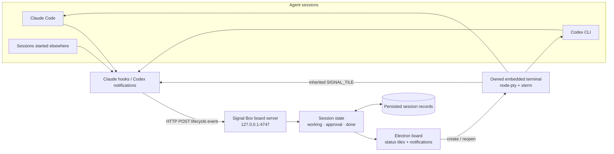

# Signal Box

Signal Box is an Electron desktop board for monitoring Claude Code and Codex CLI
sessions. Tiles represent persistent agent state:

| Lamp | State | Meaning |
| --- | --- | --- |
| Green | Working | The agent is handling a turn. |
| Amber | Approval | The agent needs permission or input. |
| Red | Done | The turn finished and needs attention. |
| Unlit | Idle | The session is open, but no lifecycle event is known. |

Signal Box receives lifecycle events through local hooks. It does not inspect
terminal text to guess state.

## Schematic



Hooks report lifecycle state to the local server; the board renders persistent
tiles and owns a correlation ID for sessions launched inside the app.

## Requirements

- Node.js 18 or newer
- npm
- Claude Code and/or Codex CLI on `PATH`
- An Electron-compatible display
- A native build toolchain if `node-pty` must compile locally

Linux and macOS are the primary targets. Windows support uses Electron and
`node-pty` but has had less testing.

## WSL2 and WSLg

WSL2 with WSLg is supported. Check the display environment:

```bash
echo "$DISPLAY"
echo "$WAYLAND_DISPLAY"
echo "$WSL_DISTRO_NAME"
```

Run npm, Claude Code, Codex, and Signal Box from the same WSL distribution.
Claude and Codex configuration is stored in the WSL home directory:

```text
/home/your-user/.claude/settings.json
/home/your-user/.codex/config.toml
```

Signal Box automatically disables Electron GPU acceleration in WSLg. Its
launcher also removes `ELECTRON_RUN_AS_NODE`, which can cause Electron to
start as plain Node.js.

## Installation

```bash
cd /home/your-user/code-traffic
npm install
```

The install includes Electron, `node-pty`, xterm, and
`@electron/rebuild`. The `postinstall` script attempts to rebuild
`node-pty` against Electron. Rebuild failure does not prevent board-only
operation.

## Start

```bash
npm start
```

The board displays project name, path, state lamp, elapsed state time, sound
control, agent selector, new-session control, and a confirmed **Clear all**
action. Clear all removes every tile and terminates processes owned by Signal
Box.

Session records are persisted in Electron’s user-data directory. A session
created by Signal Box remains an owned, openable tile after restarting the app;
clicking it starts Claude with `--resume` or Codex with `resume` when a session
ID is available.

## Claude Code hooks

Install the global Claude hooks once:

```bash
npm run install-hooks
```

This updates `~/.claude/settings.json`. The installer preserves unrelated
settings and hooks, creates a backup, is idempotent, and rejects invalid JSON
without modifying the file.

Inspect the generated handlers:

```bash
npm run hooks:print
```

Inside Claude Code, run `/hooks` to inspect active hooks and their source file.

## Codex notifications

Install the Codex adapter:

```bash
npm run install-codex-hooks
```

This updates `$CODEX_HOME/config.toml` when `CODEX_HOME` is set, otherwise
`~/.codex/config.toml`, and points Codex notifications at `codex-notify.js`.
Inspect the generated line with:

```bash
node codex-hooks.js --print
```

The adapter maps notification names containing `start`, `begin`, `working`,
`approval`, `permission`, and `request_user_input`. Other notifications
are treated as completed turns.

The adapter currently applies to Codex CLI sessions. The Codex VS Code
extension starts its own `codex app-server` process and consumes that process's
JSON-RPC stream inside VS Code, so it does not invoke this CLI notification
adapter. Use Codex from the VS Code integrated terminal for Signal Box
integration, or use the Signal Box New Session control. Direct monitoring of
the VS Code Codex panel requires a separate VS Code companion extension.

## Spawn an agent from Signal Box

1. Start Signal Box.
2. Select **Claude Code** or **Codex**.
3. Click **+ New session**.
4. Choose a project directory.
5. The selected CLI starts in that directory.
6. The embedded terminal opens.

Use **← Board** or Escape to leave the terminal view. The agent keeps running.
Use **Close session** to kill a Signal Box-owned process after confirmation.

The embedded view launches an agent directly. It is not a general shell for
commands such as `npm run dev`.

## Start agents manually

From a WSL terminal:

```bash
cd /path/to/project
claude
```

or:

```bash
cd /path/to/project
codex
```

These sessions appear as external tiles. They are visible but not clickable
into their original terminal because Signal Box did not create their PTY.

At startup, Linux/WSL process discovery finds processes named `claude` and
`codex`, reads their working directories, and creates unlit external tiles.
The first matching hook associates a process with its agent session ID.

## Manual hook test

Start Signal Box first, then run:

```bash
curl -sS -X POST \
  -H 'Content-Type: application/json' \
  --data '{"session_id":"manual-test","cwd":"/tmp/demo"}' \
  'http://127.0.0.1:4747/hook?state=working'
```

A green `/tmp/demo` tile should appear. Test the other states:

```bash
curl -sS -X POST --data '{"session_id":"manual-test","cwd":"/tmp/demo"}' \
  'http://127.0.0.1:4747/hook?state=approval'

curl -sS -X POST --data '{"session_id":"manual-test","cwd":"/tmp/demo"}' \
  'http://127.0.0.1:4747/hook?state=done'
```

The server replies with HTTP 200 immediately, then processes the event.

## Custom port

The default endpoint is `127.0.0.1:4747`. Set the same port when installing
hooks and starting the app:

```bash
export SIGNAL_BOX_PORT=4848
npm run install-hooks
npm run install-codex-hooks
npm start
```

The app reports a useful error if the selected port is already occupied.

## Sound

Click **Sound off** once to enable audio. The choice is saved locally.

- Working: one quiet tone
- Approval: two rising tones
- Done: two falling tones

Repeated events are silent; only real state changes play a sound.

Signal Box also sends a native desktop notification for each real working,
approval, or done transition. Native notification sounds depend on the desktop
notification service. WSLg often does not provide the Linux
`org.freedesktop.Notifications` service, so Signal Box uses a Windows system
sound through `powershell.exe` there and avoids the failing libnotify path. The
in-app WebAudio tone remains available as well.

## Troubleshooting

### Electron does not start

Use the project launcher:

```bash
unset ELECTRON_RUN_AS_NODE
npm start
```

Do not run `node main.js` directly.

### No tiles

Confirm Signal Box is running and test the endpoint with the curl command above.
If curl creates a tile, inspect Claude with `/hooks` and check:

```bash
rg '127\\.0\\.0\\.1|UserPromptSubmit|SessionEnd' ~/.claude/settings.json
```

Hooks intentionally use `|| true`, so a stopped app does not break an agent.
Existing sessions may need a new prompt after hooks are installed.

### Every tile is green

Startup process detection does not know whether a discovered process is active,
so discovered external sessions begin unlit. A real lifecycle hook changes the
tile to green, amber, or red.

### Blank terminal view

Reinstall dependencies and restart:

```bash
npm install
npm start
```

Capture diagnostics if needed:

```bash
npm start 2>&1 | tee /tmp/signal-box.log
```

Look for `[renderer:` or `[terminal-init]`.

### node-pty unavailable

The board can display external sessions while embedded spawning is disabled.
Try:

```bash
npm rebuild node-pty
npx electron-rebuild -f -w node-pty
```

Then restart Signal Box.

## Development checks

```bash
node --check hooks.js
node --check codex-hooks.js
node --check codex-notify.js
node --check board.js
node --check main.js
node --check preload.js
node --check processes.js
node --check renderer/app.js
node --check renderer/audio.js
node test/board.test.js
```

The board test needs permission to bind a loopback port.

## Project structure

```text
board.js                    Session state and hook server
hooks.js                    Claude settings installer
codex-hooks.js              Codex config installer
codex-notify.js             Codex notification adapter
processes.js                Linux/WSL process discovery
main.js                     Electron main process and PTY manager
launch-electron.js          WSL Electron launcher
preload.js                  Restricted IPC bridge
renderer/                   UI, xterm view, sound, and styling
test/board.test.js          Board integration test
```

## Current limitations

- External sessions are visible but not clickable into their original terminal.
- Process discovery targets Linux and WSL.
- The embedded view launches Claude or Codex directly, not arbitrary shell
  commands.
- Codex notification payloads vary by CLI version, so mapping is heuristic.
- The VS Code Codex panel requires a companion integration; the CLI adapter
  does not observe it.
- Silent agent loops without lifecycle events are not detected.
