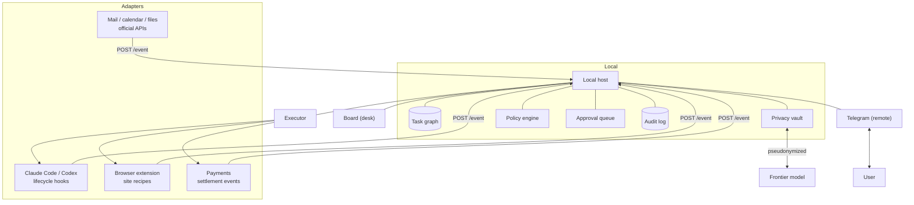

# Signal Box: Technical Design

*Local ingest, pseudonymized reasoning, bounded action, receipts on both sides. Draft 2.*

```
adapters → /event → task graph ──→ prioritizer ──→ scheduler ──→ Telegram
                         ↑                                          │
                    vault (local)                              decision
                         ↓                                          │
                  frontier model                                    ↓
                                          policy → executor → receipt → audit
```

This document describes the components, data formats, and execution model for Signal Box. It assumes an Electron application and a local host process on the same machine as the agents, browser, and data it works with. Sections are marked **[built]** where they describe the current implementation and **[proposed]** where they describe work not yet done.

### Implementation alignment note

The current application is the single-user Gmail, Calendar, selected Drive, and browser-recipe vertical slice of this design. The board, Telegram approval surface, liveness handling, authenticated legacy hooks and generalized `/event` endpoint, durable SQLite approvals/tasks/notifications, redacted lifecycle audit records, Google OAuth and read-only connectors, deterministic task extraction, scheduled digests, data export/deletion, reviewed Gmail replies, AES-256-GCM entity storage backed by OS-protected key storage, schema-constrained local entity recognition and local/frontier ranking over pseudonymized tasks, capability registration, unknown-capability rejection, terminal desk-only policy, an isolated frontier-model gateway, browser recipe primitives, approval binding, durable browser execution attempts, and receipts are built. Complete site-specific browser adapters, complete future-action policy coverage, standing authority, payments, and multi-user operation remain proposed or explicitly excluded from this implementation cycle. The default model mode is local with deterministic fallback; no remote model call is required unless explicitly configured.

## Contents

1. [Architecture](#1-architecture)
2. [Event model](#2-event-model)
3. [Ingest](#3-ingest)
4. [Privacy vault](#4-privacy-vault)
5. [Extraction](#5-extraction)
6. [Task graph](#6-task-graph)
7. [Prioritization](#7-prioritization)
8. [Approval protocol](#8-approval-protocol)
9. [Execution](#9-execution)
10. [Session state and liveness](#10-session-state-and-liveness)
11. [Surfaces](#11-surfaces)
12. [Policy engine](#12-policy-engine)
13. [Proactive scheduler](#13-proactive-scheduler)
14. [Audit log](#14-audit-log)
15. [Security](#15-security)
16. [Reliability](#16-reliability)
17. [Storage and stack](#17-storage-and-stack)
18. [Milestones](#18-milestones)
19. [Open problems](#19-open-problems)

## 1. Architecture

Five layers, one local host. **Adapters** turn external signals into events. The **host** owns the task graph, the vault, policy, the approval queue, and the audit log. The **executor** carries out approved actions through agents, recipes, or payments. **Surfaces** render state and carry decisions. The **vault** sits between everything local and anything remote.



Three invariants the rest of the document depends on.

**State is reported, never inferred.** Signal Box does not read terminal output or rendered pages to guess what is happening. An adapter that cannot emit a signal produces an unlit tile rather than a guess. The one deliberate exception is staleness ([section 10](#10-session-state-and-liveness)), which exists precisely because a silent actor cannot report its own silence.

**Nothing crosses the vault in plain form.** Any path from local data to a remote model passes through pseudonymization. This is enforced at a single chokepoint rather than by discipline at each call site.

**Authority precedes capability.** An executor has no path to an action that has not cleared policy. Adding a capability means adding it behind the check, not beside it.

Adapters run as separate processes, never inside Electron main. A dead adapter degrades the system; it does not break it. This mirrors the `|| true` in the installed hooks, which ensures a stopped Signal Box never breaks a running agent.

## 2. Event model

### 2.1 Current shape **[built]**

```
POST /hook?state=working|approval|done
{ "session_id": "...", "cwd": "/path/to/project" }
```

Bodies are limited to 1 MiB (413 above that); malformed URLs receive 400; the server answers 200 after processing.

### 2.2 Generalized shape **[proposed]**

`/hook` is retained permanently as a shim so installed hooks never break. New adapters post to `/event`.

```jsonc
{
  "source": "claude" | "codex" | "gmail" | "calendar" | "relay" | "<adapter-id>",
  "actor_id": "stable-per-thing-id",   // session id, thread id, recipe run id
  "type": "state" | "observation" | "marker" | "settlement",
  "state": "working" | "approval" | "done" | "idle",   // type=state only
  "title": "signal-box",
  "subtitle": "~/code-traffic",
  "payload": { },                      // type-specific; see below
  "seq": 41,                           // monotonic per (source, actor_id)
  "ts": 1789546323412
}
```

Events are idempotent on `(source, actor_id, seq)`; repeats are acknowledged and dropped. Out-of-order events are discarded. This subsumes the current special case where a generic stop event must not overwrite an outstanding approval — with sequence numbers that becomes ordering rather than a rule.

Every event is authenticated with a shared token read from a `0600` file. This is not optional once events carry mail content.

### 2.3 Event types

| Type | Emitted by | Payload | Effect |
|---|---|---|---|
| `state` | Coding agents | — | Moves a session tile |
| `observation` | Ingest connectors | Normalized message, event, or file change | Enters the extraction pipeline |
| `marker` | Anything | `{ label }` | Written to the audit log; no state change |
| `settlement` | Payments | `{ amount, currency, merchant, tx_ref }` | Receipt against a standing authority |

Markers are semantic timestamps an actor volunteers — `test_suite_passed`, `payment_settled`, `approval_shown`. They cost nothing to emit and are the ground truth other tooling keys on, including deterministic editing of screen recordings, where "when did something worth showing happen" is otherwise unanswerable from pixels.

## 3. Ingest

### 3.1 Tiering

The tier of a service is decided before any code is written for it.

| Tier | Reach | Mechanism |
|---|---|---|
| 0 | Official API | OAuth, documented endpoints, stable contract |
| 1 | Internal API, session cookies sufficient | Recorded recipe replayed in the browser or from the host |
| 2 | Internal API, page-signed requests | Recipe replayed inside the site's own page |
| 3 | Bot-detected or mobile-only | Manual, or UI automation fallback |

**Tier 0 is the rule, not the fallback.** Mail, calendar, and files have official APIs. Recording their internal traffic breaks without notice, risks the account, and buys nothing. Recipes exist only where no sanctioned path does.

### 3.2 Connector contract **[proposed]**

A connector polls or subscribes, normalizes, and emits `observation` events. It never writes to the task graph directly — extraction is a separate stage so that re-extraction over old observations is possible when the extractor improves.

```jsonc
{ "source": "gmail", "actor_id": "thread_18f2a", "type": "observation",
  "payload": {
    "kind": "message",
    "thread_id": "18f2a", "message_id": "18f2a:7",
    "from": "priya@example.com", "to": ["me@example.com"], "cc": [],
    "sent_at": 1789460000000,
    "subject": "…", "body_text": "…",
    "list_unsubscribe": false, "in_reply_to": "18f2a:6"
  },
  "seq": 7, "ts": 1789460000100 }
```

### 3.3 Cheap filtering before anything expensive

Most mail is not a commitment, and running extraction over everything is both slow and the main source of junk tasks. Deterministic filters run first:

- The user is in `To:`, not only `Cc:`
- The last message in the thread is not from the user
- No `List-Unsubscribe` header; sender is not a no-reply address
- The thread is older than a short threshold, so live conversations settle first

Only survivors reach extraction. This keeps cost near zero and, more importantly, keeps precision high by never asking the extractor about material that could only produce noise.

### 3.4 Browser recipes **[primitives built; site adapters proposed]**

For tier 1 and 2, a browser extension records a task once as the sequence of API calls the site makes, maps the variable parts into named inputs, and replays it later from inside the user's logged-in page so the site's own code signs the requests.

Recipes have an `effects` class — `read`, `reversible`, `commit` — which is the input to policy. Read recipes run freely, reversible ones are logged, commit ones require an approval before the first committing request. Response schemas are recorded so drift is detected before an action rather than after.

Signal Box now validates recipe structure, evaluates assertions in the trusted host before a commit step, binds inputs and recipe digests to the action, stops before commit for approval, and records prepared/authorized/confirmed/awaiting-approval receipt states. The `uber.book-cab.v1` example demonstrates the complete flow against an injected browser adapter, and a Manifest V3 extension provides allowlisted navigation and page operations over authenticated loopback request/result endpoints with renderer-guided pairing and a persistent single-user browser session. Each bridge request is claimed once, exposes a polling heartbeat for setup diagnostics, expires safely, and rejects an abandoned executor wait. Frontier ranking is gated on local privacy-model availability and falls back to deterministic ranking otherwise. Calendar events can be edited through an ETag-checked, approval-bound Google Calendar action. A read-only quote preflight supports live selector validation without committing a booking; running it against a real provider account remains an external release check.

## 4. Privacy vault

**[proposed]** The chokepoint between local data and any remote model.

### 4.1 Detection ladder

| Stage | Method | Covers |
|---|---|---|
| 1 | Deterministic patterns | Emails, phone numbers, card fragments, account and order IDs, URLs, postal codes, IBANs |
| 2 | Local entity recognition | Person, organization, and location names |
| 3 | Known-entity list | Contacts, projects, vendors already in the graph |

The ladder order matters. Everything that can be caught by a pattern is, because a pattern's coverage is knowable and a model's is not. Stage 2 uses a local model for *recognition* — a narrow, benchmarkable task — and never for judging what counts as sensitive.

### 4.2 Stable pseudonyms

```jsonc
// local only, never transmitted
{ "priya@example.com": "PERSON_7",
  "Acme Logistics":    "VENDOR_3",
  "Project Meridian":  "PROJECT_2",
  "12 Rose Lane, …":   "ADDRESS_1" }
```

Assignment is content-addressed and permanent for the life of the vault. Instability is the silent killer: if a person is `PERSON_7` today and `PERSON_2` tomorrow, every cross-session inference collapses without any visible error.

Outbound text is substituted at the chokepoint; inbound text is rehydrated on the same boundary. The frontier model sees:

> PERSON_7 has been waiting 4 days on a deliverable tied to PROJECT_2, due Friday.

Which is fully sufficient to rank it. Ranking needs structure, not identity.

### 4.3 Enforcement

The vault is not a helper function that call sites are expected to use. Remote model access is available only through a client that applies substitution, and that client is the only code in the process holding the API credential. A leak then requires bypassing the credential, not forgetting a call.

A local-only mode disables remote escalation entirely: extraction and ranking degrade to a smaller local model, with reduced quality and no data leaving the machine.

## 5. Extraction

**[proposed]** Observations become candidate tasks.

Output is strictly schematized — the model fills a form, it does not write prose:

```jsonc
{ "kind": "commitment_by_me" | "commitment_to_me" | "deadline" | "request",
  "summary": "Send revised deck to PERSON_7",
  "counterparty": "PERSON_7",
  "due": "2026-09-19" | null,
  "due_basis": "explicit" | "inferred" | "none",
  "evidence_span": [412, 486],       // offsets into the source message
  "confidence": 0.0 – 1.0 }
```

Three rules that decide whether the graph is trustworthy:

**Evidence spans are mandatory.** An extraction that cannot point at the text that produced it is discarded. This is a cheap, hard check on fabrication.

**Confidence gates behaviour, not display.** Below a threshold a candidate is stored but never surfaced proactively. It can still be found when the user asks.

**Re-extraction is possible.** Observations are retained separately from tasks, so an improved extractor can be run over history without re-ingesting.

Corrections are the training signal. Every user edit — wrong counterparty, wrong date, not a task at all — is stored against the source span, and periodically sampled to measure precision over time.

## 6. Task graph

**[proposed]**

```jsonc
{
  "id": "tsk_4b19",
  "state": "pending" | "active" | "blocked" | "done" | "dropped",
  "blocked_on": { "party": "PERSON_7", "since": 1789460000000 } | null,
  "summary": "Send revised deck to PERSON_7",
  "due": "2026-09-19", "due_basis": "explicit",
  "provenance": {
    "source": "gmail", "thread_id": "18f2a", "message_id": "18f2a:7",
    "observed_at": 1789460000100, "evidence_span": [412, 486]
  },
  "confidence": 0.86,
  "links": [ { "rel": "resolves", "task": "tsk_3c02" } ],
  "actions": [ { "kind": "draft_reply", "recipe": null },
               { "kind": "run_agent", "cwd": "/home/user/deck" } ],
  "corrections": [ { "field": "due", "from": "2026-09-18",
                     "to": "2026-09-19", "at": 1789470000000 } ],
  "history": [ { "state": "pending", "at": 1789460000100 } ]
}
```

### 6.1 States

| State | Meaning | Leaves by |
|---|---|---|
| `pending` | Known, not started | User starts it, or it becomes due |
| `active` | In progress | Completion, or becoming blocked |
| `blocked` | Waiting on a named party | That party responds, or the user unblocks |
| `done` | Finished | Terminal |
| `dropped` | Abandoned deliberately | Terminal |

`blocked` with a named party and a since-timestamp is the most valuable state in the system. It is what generates "PERSON_7 has been waiting four days," which is the one thing no individual application can say.

### 6.2 Automatic transitions

A task moves without asking when an unambiguous event says so: a reply from the blocking party moves `blocked` → `active`; a calendar event passing moves a meeting-bound task forward; a settlement event closes a payment task.

Automatic transitions are always logged with the event that caused them, and they never produce a notification. Nothing is required of the user, so nothing should interrupt them.

### 6.3 Why this is the product

Connectors are replicable. Recipes are replicable. A six-month record of what the user owes whom, with provenance and correction history, is not — it is the only asset here that compounds and that a competitor cannot copy. Everything else in this document is ingest and delivery for it.

## 7. Prioritization

**[proposed]** Runs on pseudonymized data. Output is a score and a reason, never an action.

```jsonc
{ "task": "tsk_4b19", "score": 0.82,
  "reason": "due in 2 days; PERSON_7 blocked 4 days; PROJECT_2 has a Friday milestone",
  "suggested_action": { "kind": "draft_reply", "id": "act_91" } }
```

Inputs: time to deadline, time blocked, counterparty importance derived from interaction history, cross-source context (a calendar event about the same project, a dependent task), and the user's own correction history.

Two design choices worth stating. The reason is mandatory and is shown to the user, because an unexplained ranking cannot be corrected. And the score is a ranking input to the scheduler, not a licence to send — [section 13](#13-proactive-scheduler) decides whether anything is delivered at all.

## 8. Approval protocol

### 8.1 What exists **[built]**

Structured questions are read from Claude Code `AskUserQuestion` tool calls and Codex `request_user_input` records. Codex session logs are polled for pending requests; tool-permission requests and the terminal approval screen are detected as well. A question with options renders as inline buttons; tapping submits that option to that session. Questions without structured options fall back to text plus explicit instructions.

### 8.2 Generalized request **[proposed]**

The object is currently coupled to PTY sessions. Extracted, it becomes the system's central type.

```jsonc
{
  "request_id": "apr_7f21",
  "actor": { "source": "claude", "actor_id": "…", "title": "signal-box" },
  "kind": "choice" | "permission" | "confirm",
  "question": "Migration drops 3 columns from users. How should I proceed?",
  "options": [
    { "id": "opt_1", "label": "Generate reversible migration",
      "description": "Adds a down migration before applying" },
    { "id": "opt_2", "label": "Proceed as written" }
  ],
  "consequences": {
    "reversible": false,
    "spend": { "amount": 0.05, "currency": "USD" } | null,
    "scope": ["db:write"],
    "counterparty": "VENDOR_3" | null
  },
  "task": "tsk_4b19" | null,
  "expires_at": 1789546383412,
  "created_at": 1789546323412
}
```

Decision:

```jsonc
{ "request_id": "apr_7f21", "option_id": "opt_1",
  "decided_by": "telegram:123456789", "surface": "telegram",
  "decided_at": 1789546341102, "latency_ms": 17690 }
```

`consequences` is the input to policy and should be populated even where policy is currently permissive — retrofitting it later means revisiting every actor.

### 8.3 Invariants

**Options are enumerated by the actor.** A decision is an option ID. Free text is never an approval, and adding it as a convenience would remove the injection defence entirely.

**Self-approval is unreachable.** No path exists from actor input or ingested content to a decision. Decisions arrive only from an authorized surface, authenticated independently.

**Single resolution.** A decision for an already-resolved request is acknowledged and discarded. A double-tap must not become two answers.

**Expiry re-asks.** State moves. An expired request is re-issued, never assumed.

**Offline decisions are not replayed.** Control messages queued during an outage are discarded at startup; an instruction against a stale world is not the instruction the user would give now. Undelivered *requests*, by contrast, are re-sent on reconnection.

## 9. Execution

### 9.1 Capabilities

| Capability | Actor | Effects class | Approval |
|---|---|---|---|
| Read mail, calendar, files | Connectors | read | None |
| Draft a reply | Host | read | None until send |
| Send a reply | Connector | commit | Always, unless standing authority covers it |
| Run a read recipe | Browser | read | None |
| Run a reversible recipe | Browser | reversible | Logged; policy may require approval |
| Run a commit recipe | Browser | commit | Always |
| Prompt a coding agent | PTY | reversible | None |
| Pay | Payments | commit | Standing authority within caps, else approval |

### 9.2 Prompt submission **[built]**

| Actor | Mechanism | Reliability |
|---|---|---|
| Codex | `codex queue` with the saved thread ID | High; purpose-built command |
| Claude Code | Prompt text and Enter as separate PTY events, confirmed by the installed `UserPromptSubmit` hook | Medium; acknowledgement depends on the hook being installed and reachable |
| Terminal | Fresh non-interactive shell in the saved directory | High; stdout and stderr returned |

The Claude path still depends on the installed hook being reachable, but the board distinguishes local PTY submission from the hook acknowledgement and can surface an unknown outcome when that acknowledgement does not arrive.

For Claude, the installed `UserPromptSubmit` hook marks the delivery as acknowledged after the agent accepts the prompt. Generic PTY writes and Codex queue submissions remain `submitted` until a matching agent event arrives; if the event never arrives, the surface must show the outcome as unknown rather than treating the local write as proof.

Terminal sessions run each command in a fresh shell, so `cd` and exported variables do not persist between commands. That isolation is deliberate.

### 9.3 Standing authority **[proposed]**

Pre-granted, bounded permission to act without asking.

```yaml
id: auth_groceries
purpose: weekly grocery reorder
scope: [commerce:order]
merchants: [grocer.example]
max_per_action: { amount: 40.00, currency: INR }
period_allowance: { amount: 2000.00, currency: INR, period: week }
max_actions_per_period: 3
valid_until: 2026-12-31
break_conditions:
  - price_delta_above: 0.20        # vs last confirmed
  - merchant_not_in_list
  - outside_scope
```

Three properties. Caps are enforced by the host from extracted amounts, not trusted from the actor. A broken condition downgrades the action to an approval request rather than failing it — the user still gets to say yes, they just have to say it. And every use writes a receipt, so an authority is auditable after the fact and revocable at any time.

### 9.4 Idempotency

Committing actions are never retried automatically. Before any commit the executor runs a read check for an existing equivalent — an active order, an existing booking, a recent identical payment — and a per-action cooldown prevents a double submission from a reconnect.

## 10. Session state and liveness

### 10.1 States **[built, extended]**

| State | Lamp | Meaning | Entered by |
|---|---|---|---|
| working | green | Handling a turn | `state: working` |
| approval | amber | Needs permission or input | `state: approval`, or a detected pending question |
| done | red | Finished, needs attention | `state: done` |
| idle | unlit | Known, no lifecycle event yet | Discovery or restore |
| stale | grey | **[proposed]** No event within the liveness bound | Server-side timer |

### 10.2 Staleness **[proposed]**

This closes the limitation that most undermines the product: a hung agent currently shows green forever.

```jsonc
{ "source": "claude", "heartbeat_expected": true,
  "heartbeat_interval_ms": 30000,
  "working_soft_limit_ms": 600000, "working_hard_limit_ms": 1800000 }
```

| Mechanism | Detects | Cost |
|---|---|---|
| Heartbeat | Adapter or actor process died | Requires adapter support |
| Soft/hard limit on `working` | Actor alive but looping | None; may false-positive on long turns |
| Process check (owned sessions) | Process gone, tile not `done` | None; immediate correction |

Past the soft limit a session is **stale** — not amber, because nothing is waiting on the user, and not red, because nothing completed. Past the hard limit it escalates to Telegram once, with an interrupt button. Limits are per-source and user-overridable, because a linting agent and a full test run are not comparable.

### 10.3 Ownership **[built]**

Owned sessions have PTYs Signal Box created; they can be opened, prompted, interrupted, and resumed after restart. External sessions are discovered, visible, and reportable but not controllable. Owned sessions inherit a correlation ID through the environment; external ones are matched on first hook by working directory.

## 11. Surfaces

### 11.1 Board (desk)

Glance-first. Tiles, lamps, elapsed time in state, the approval queue, and today's ranked tasks. Reading many states must not require reading — colour and position carry it. The board is also the only surface for desk-only approvals ([section 12](#12-policy-engine)).

### 11.2 Telegram (remote) **[built]**

A token from BotFather, then `/start` returns a chat ID which is entered to complete pairing. Only that chat is accepted. Optional: Signal Box runs locally without it.

| Command | Effect |
|---|---|
| `/sessions` | List sessions and states; opens the picker |
| `/use <n>` | Select an owned session |
| `/status` | State of the selected session |
| `/send <text>` | Prompt or shell command; plain text does the same |
| `/tail` | Last three input/output pairs |
| `/history` | Full conversation as pairs |
| `/interrupt` | Ctrl+C |

**[proposed]** Additions: `/today` for the ranked digest on demand, `/done <n>` and `/snooze <n>` to move a task, and a "not useful" button on every proactive message.

### 11.3 Surface parity

A surface renders what the host tells it it may render. It does not decide what it is permitted to show, and it never evaluates policy. Adding a surface therefore cannot widen authority — a property worth preserving when a native app or a voice surface is eventually added.

## 12. Policy engine

**[proposed]** Decides where a request may be decided, and what may proceed without one.

```yaml
default: desk_or_remote

rules:
  - when: { effects: commit, spend_above: { amount: 25.00, currency: INR } }
    require: desk
  - when: { scope_contains: "db:write", reversible: false }
    require: desk
  - when: { source: terminal }
    require: desk                     # shell commands are not a phone decision
  - when: { effects: read }
    require: none
  - when: { covered_by_standing_authority: true }
    require: none
    receipt: always
```

Policy is evaluated on the host, never on a surface. `consequences` on the request is the input. A rule may *raise* the requirement for a class of action; nothing an actor sends can lower it.

## 13. Proactive scheduler

**[proposed]** The component that decides whether to speak. It is the difference between a colleague and an app people mute.

```yaml
priority_floor: 0.55          # below this, never send unprompted
daily_cap: 4                  # non-approval messages
digest_at: "08:30"
quiet_hours: { from: "22:00", to: "07:30", approvals_exempt: true }
debounce_window_s: 300
```

| Class | Delivery |
|---|---|
| Approval request | Immediate; exempt from the cap; quiet-hours exempt if configured |
| Escalated stale agent | Immediate; once per session |
| High-priority task above the floor | Immediate, subject to the cap |
| Everything else above the floor | Batched into the digest |
| Below the floor | Never sent; visible only when asked |

Every proactive message carries a suppression control. A dismissal is recorded against the task's class and counterparty and raises the effective floor for similar items — the user is teaching the scheduler, and that must be a single tap.

Caps are enforced in code. Precision over recall: a missed task costs almost nothing, a wrong interruption costs the user permanently.

## 14. Audit log

**[built]** Redacted append-only local records cover accepted events, connector health and observations, requests, decisions, actions, notifications, feedback, and receipts. The log is reconstructable on the user's machine, not tamper-proof against its owner.

```jsonc
{ "ts": 1789546341102, "kind": "decision",
  "request_id": "apr_7f21", "actor": { "source": "claude", "actor_id": "…" },
  "question_digest": "sha256:…", "option_id": "opt_1",
  "decided_by": "telegram:123456789", "surface": "telegram",
  "policy": "reversible_any", "latency_ms": 17690 }

{ "ts": 1789546349000, "kind": "action",
  "capability": "commerce:order", "authority": "auth_groceries",
  "amount": { "value": 38.20, "currency": "INR" },
  "idempotency_key": "…", "result": "ok", "receipt": "ord_5512" }
```

Three uses, ascending in value: it makes a wrong approval diagnosable; it makes system behaviour reconstructable after an incident; and it is the artifact any organization deploying agents with real permissions will eventually be required to produce, which makes it the natural basis for a multi-user tier.

Question and message text is hashed by default, with full text retained only on opt-in, since both routinely contain code, paths, and personal content.

## 15. Security

| Threat | Mitigation | State |
|---|---|---|
| Local process posting events or reading state | Shared token in a `0600` file on `/event` and the history API | **Proposed** |
| Bot token as a remote execution credential | OS keychain via Electron `safeStorage` | **Proposed** |
| Unauthorized remote control | Single bound chat ID; all other messages discarded | Built |
| Prompt injection via mail, web, or agent output | Decisions are option IDs from an enumerated set; no free-text approval path; actors cannot create requests they then self-approve | Built / **formalize** |
| Ingested content treated as instruction | Observations enter as data; extraction output is schema-constrained with mandatory evidence spans | **Proposed** |
| Data leaving the machine | Vault chokepoint owns the only remote credential; local-only mode available | **Proposed** |
| Duplicate commits | No auto-retry on commit; idempotency pre-checks; per-action cooldown | **Proposed** |
| Overspend | Host-enforced caps from extracted amounts; break conditions downgrade to approval | **Proposed** |
| Stale instructions after downtime | Queued control commands discarded at startup | Built |
| Runaway behaviour | Human-rate limits, global pause, full audit log | Partly built |

The injection posture stated plainly: an agent that reads hostile content can be made to *ask* for anything. It cannot be made to *answer*. Everything else is defence in depth around that one separation.

## 16. Reliability

| Class | Signal | Response |
|---|---|---|
| adapter_down | No heartbeat, no events | Mark stale; never guess state |
| actor_hung | `working` past soft limit, process alive | Stale tile; escalate once past hard limit |
| actor_dead | Process gone, tile not `done` | Immediate correction from process check |
| delivery_failed | Prompt written, no transition in window | Report to the requesting surface; never assume success |
| auth | 401/403, login redirect, Telegram `Unauthorized` | Pause; ask the user to sign in; never automate login |
| drift | Recipe response fails its recorded schema | Stop before acting; mark broken; prompt re-record |
| blocked | Challenge page, captcha, 429 | Back off for that site; suggest manual |
| business | Valid response saying no | Normal outcome; update the task |
| transient | 5xx, timeout | Retry read and reversible only, with backoff |
| expired | Decision after `expires_at` | Discard; re-ask |

Two rules dominate: nothing is retried into a committing action, and no failure resolves as an assumption. An unanswered question stays unanswered and visible.

A daily canary runs one read-only recipe per site to catch drift before a user needs it.

## 17. Storage and stack

**[built]** Electron main with a Node host; `node-pty` and `xterm` for owned terminals; `@electron/rebuild` for the native module. Session records persist in Electron's user-data directory; owned sessions survive restart as resumable tiles. Packaging is Electron Forge across Linux, macOS, and Windows on x64 and arm64 through a tagged GitHub Actions workflow, with the macOS `spawn-helper` explicitly unpacked and made executable.

**[proposed]** SQLite for observations, tasks, corrections, approval requests, decisions, authorities, and the audit log — the log needs append-only durability and the approval queue needs transactional single-resolution. The vault is a separate encrypted store, keyed from the OS keychain, never included in backups by default. Secrets move to `safeStorage`.

Read-only local API, loopback-bound and token-authenticated:

```
GET /api/sessions
GET /api/sessions/<key>/history    → { pairs[], pendingQuestions[] }
GET /api/tasks?state=&due_before=  → { tasks[] }
GET /api/approvals                 → { pending[] }
```

## 18. Milestones

| Milestone | Scope | Exit test |
|---|---|---|
| M0 Correctness | Staleness, process liveness, verified prompt delivery | A killed agent and a hung agent are both visibly not-green within the bound |
| M1 Hardening | Event-server token, keychain secrets, stated transit boundary | No plaintext secret on disk; an unauthorized local process cannot post or read |
| M2 Schema | `/event` with source/seq/type, `/hook` shim, adapter registration | A third agent is supported without changing Electron code |
| M3 Ingest | Mail connector, deterministic filters, observation store | A day of mail is ingested and filtered with no extraction yet |
| M4 Vault | Pattern detectors, local entity recognition, stable pseudonyms, chokepoint client | No unpseudonymized identifier reaches the remote client, verified by inspection |
| M5 Graph | Extraction with evidence spans, task store, corrections, provenance view | A week of tasks where every item traces to its source in one tap |
| M6 Proactive | Prioritizer, scheduler, digest, suppression control | Seven days of digests within the cap, with a measured false-positive rate |
| M7 Protocol | Approval request generalized, consequences, expiry, single resolution | A non-CLI actor receives a decision through the same path |
| M8 Policy and receipts | Policy rules, desk-only classes, audit log | A destructive action cannot be approved from a phone; a month is reconstructable |
| M9 Recipes | Browser capture, mapping, read-only replay | An agent answers an order-status question without opening a site |
| M10 Acting | Reversible then commit recipes, idempotency, confirmation | One real task completed end to end with one approval |
| M11 Spend | Standing authority, host-enforced caps, break conditions, receipts | An in-limit purchase runs; an out-of-limit one becomes a question |
| M12 Multi-user | Shared board and queue, per-user identity on decisions | Two people supervise one set of actors with no double-resolution |

## 19. Open problems

**Extraction precision on real mail.** The number that decides whether anything downstream is worth building, and it is measurable in two weeks. Precision matters far more than recall: a plausible wrong task costs attention and trust, a missed one costs almost nothing.

**Verifying non-Claude prompt delivery.** Generic PTY writes and Codex queue acceptance are local submission signals. Signal Box now moves them to visible `unknown` after a bounded acknowledgement window without duplicate resubmission; live sessions still need to confirm that installed agent notifications reliably arrive for those paths.

**Soft-limit tuning.** One working-state timeout cannot serve both a lint fix and a long test run. Per-source defaults help; learned per-session baselines are themselves a guess.

**Entity resolution in the vault.** The same person appears as a personal address, a work address, a display name, and a nickname. Under-merging fragments history; over-merging conflates two people. This is the vault's hardest problem and it has no clean answer.

**Cross-device state.** Carts, reservations, and drafts are shared with the user's phone. A recipe running while the user is acting on the same account can conflict, and there is no model of that today.

**Multi-surface resolution.** A desk board and a phone can both show a live request. Single-resolution handles correctness; the interfaces should also make an answered request visibly disappear.

**How much content should leave the machine.** Digests and completion messages carry content, which is what makes them useful and what makes the Telegram boundary consequential. A digest-only-titles mode is possible and much less useful.

**Process discovery beyond Linux.** Discovery targets Linux and WSL; macOS and Windows external sessions are invisible until their first hook.

---

*Companion to the Signal Box overview. Payloads marked proposed are illustrative. See the Relay document for browser capture, mapping, and recipe execution in detail.*
